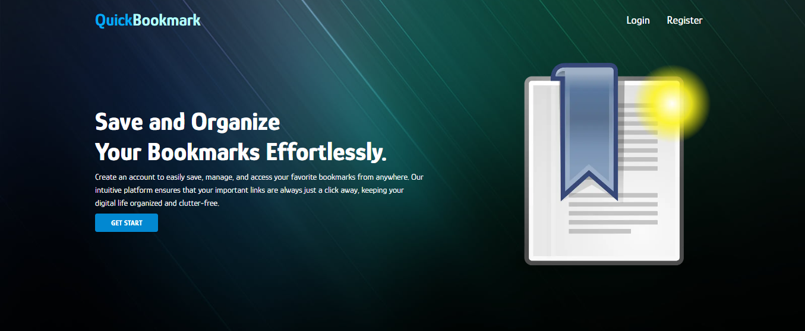

# Quick BookMark

A Full-stack web application to Save and Organize Bookmarks. Create an account to easily save, manage, and access your favorite bookmarks from anywhere. Our intuitive platform ensures that your important links are always just a click away, keeping your digital life organized.

### Live Site: https://quick-bookmark.vercel.app

### Used Technologies: Typescript, Express.js, MongoDB, Mongoose, Next.js, Redux-toolkit, MUI, Zod

## Features

- Use login / register a account with email or social account
- view profile, update profile, change password, forgot password, profile verification
- Create folder and add bookmark in separate folder
- Manage Bookmarks by its dashboard search with title or tag , pagination
- Admin Dashboard to manage user and some features.
